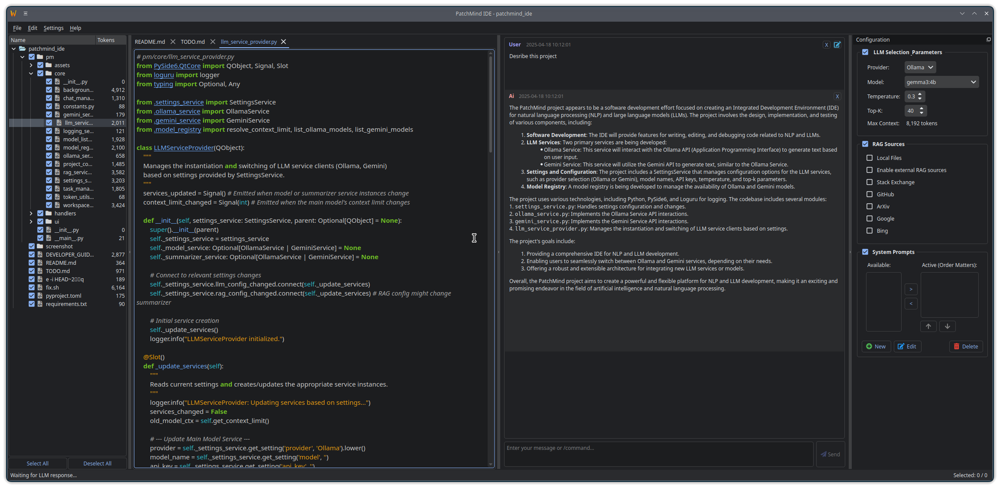

# PatchMind IDE

PatchMind is an AI-enhanced code editor with inline LLM support, real-time prompt workflows, and RAG-based file context awareness.



## ✨ Features

- **LLM Chat Integration** — Chat with Gemini or Ollama-backed models
- **Inline Editing** — Apply prompts directly to open documents
- **Prompt Manager** — Save, reuse, and batch-apply prompts to files
- **Real-Time Context** — File tree with checkboxes for RAG context control
- **Token Awareness** — Visual context token tracking and budgeting
- **Themes & Fonts** — Customizable editor appearance
- **Multi-Provider Support** — Easily switch between LLMs

## 🔧 Requirements

- Python 3.11+
- [Poetry](https://python-poetry.org/docs/#installation) (Recommended for development) or `pip`
- An Ollama instance running (locally or via Docker)

## 🚀 Running Locally

There are two main ways to install and run PatchMind locally:

**1. Using Poetry (Recommended)**

```bash
# Clone the repository (if you haven't already)
# git clone <repository_url>
# cd patchmind-ide

# Install dependencies using Poetry
poetry install --no-dev

# Run the application
poetry run python -m pm
```

**2. Using Pip**

```bash
# Clone the repository (if you haven't already)
# git clone <repository_url>
# cd patchmind-ide

# Install dependencies using pip
pip install -r requirements.txt

# Run the application
python -m pm
```

## 🐳 Running with Docker Compose

This method runs both the PatchMind IDE and an Ollama instance in separate containers using Docker Compose. This is useful for isolating dependencies and ensuring a consistent environment.

**Prerequisites:**

- Docker ([Install Docker](https://docs.docker.com/engine/install/))
- Docker Compose ([Install Docker Compose](https://docs.docker.com/compose/install/))
- An X Server running on your host machine (this is standard on most Linux desktops).

**Steps:**

1.  **Allow Container Access to X Server:**
    You need to explicitly grant containers permission to connect to your host's X Server for the GUI to display. Open a terminal on your host machine and run:
    ```bash
    xhost +local:docker
    ```
    *(Note: This command allows any local user running Docker containers to connect to your X server. This is generally safe for local development but be aware of the security implications if you run untrusted containers. You can revoke permission later with `xhost -local:docker`)*

2.  **Build and Run:**
    Navigate to the project's root directory (where `docker-compose.yml` is located) in your terminal and run:
    ```bash
    docker compose up --build
    ```
    This command will:
    - Build the `patchmind-ide` Docker image based on the `Dockerfile` (if not already built).
    - Download the `ollama/ollama` image (if not already present).
    - Start both the `patchmind-ide` and `ollama` containers.
    - The PatchMind IDE GUI should appear on your desktop.

3.  **Using Ollama:**
    - The IDE container is configured to connect to Ollama at `http://ollama:11434`.
    - You will need to pull models into the Ollama container *after* it starts. You can do this by opening another terminal and running:
      ```bash
      docker exec -it patchmind-ollama ollama pull llama3:8b
      # Or any other model you need
      ```
    - The IDE should then be able to list and use the models pulled into the `ollama` container.

4.  **Stopping:**
    - Press `Ctrl+C` in the terminal where `docker compose up` is running.
    - To ensure containers are fully stopped and removed, run:
      ```bash
      docker compose down
      ```
    - Ollama models will be persisted in the `./ollama_data` volume on your host.

**Troubleshooting Docker:**

- **GUI doesn't appear / X11 Connection Error:** Ensure `xhost +local:docker` was run correctly and your `DISPLAY` environment variable is set properly on the host. Check the container logs (`docker logs patchmind-ide-app`). You might need to adjust volume mounts for X11 authentication (`XAUTHORITY`) depending on your system setup.
- **Cannot connect to Ollama:** Verify the `ollama` container is running (`docker ps`). Check the `OLLAMA_HOST` environment variable in the `docker-compose.yml` file and ensure the IDE's Ollama client uses it (this might require code adjustments if the client library doesn't automatically pick up `OLLAMA_HOST`).

## 🧠 Development

- Auto-format: `black .`
- Lint: `ruff .`

## 🗂 Project Structure

```
pm/
├── core/               # Logic, config, services
├── ui/                 # Qt widgets & dialogs
├── handlers/           # Connects UI events to Core logic
├── assets/             # QSS stylesheets, etc.
├── __main__.py         # Entry point
Dockerfile              # For building the Docker image
docker-compose.yml      # For running with Docker Compose
pyproject.toml          # Poetry config
README.md               # This file
...
```

## 📋 Guidelines

- Follows [PEP8](https://peps.python.org/pep-0008/) with `black` & `ruff`
- Use `Signal/Slot` correctly with type annotations
- Never modify the GUI from non-main threads — use signals
- See `DEVELOPER_GUIDELINES.md` for more details.

## 📄 License

MIT © Kal Aeolian